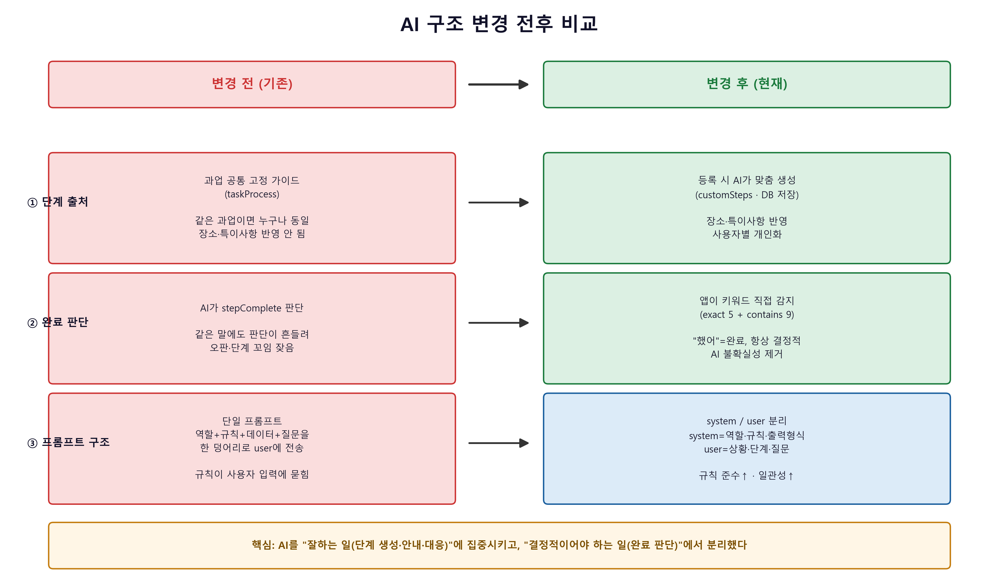
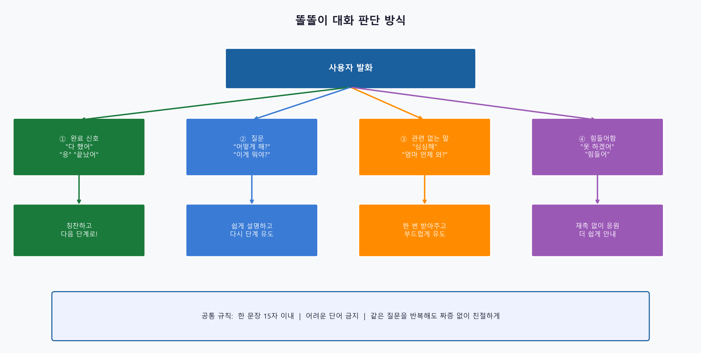
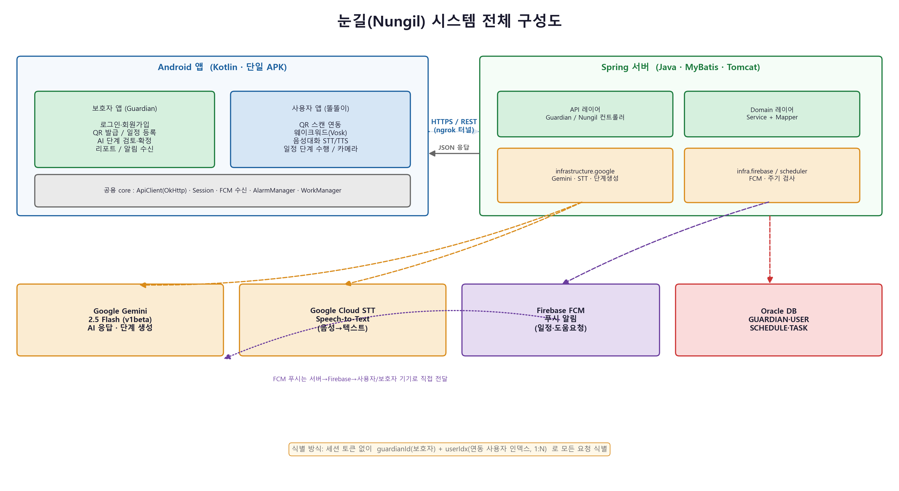
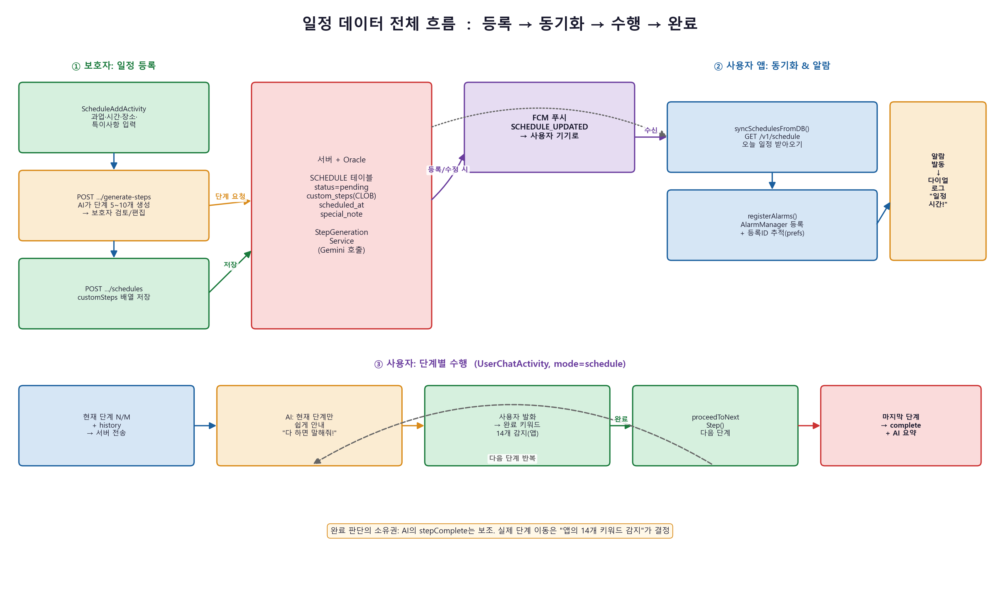
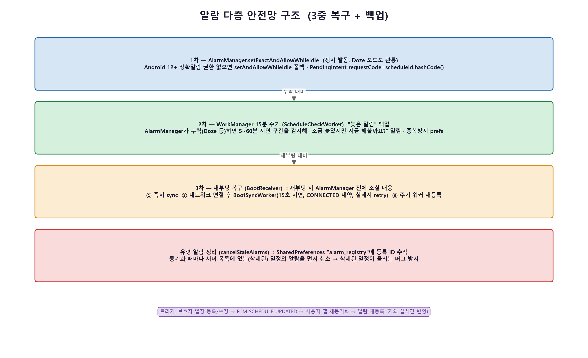
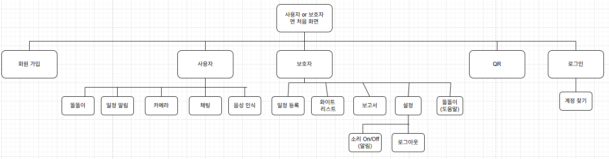
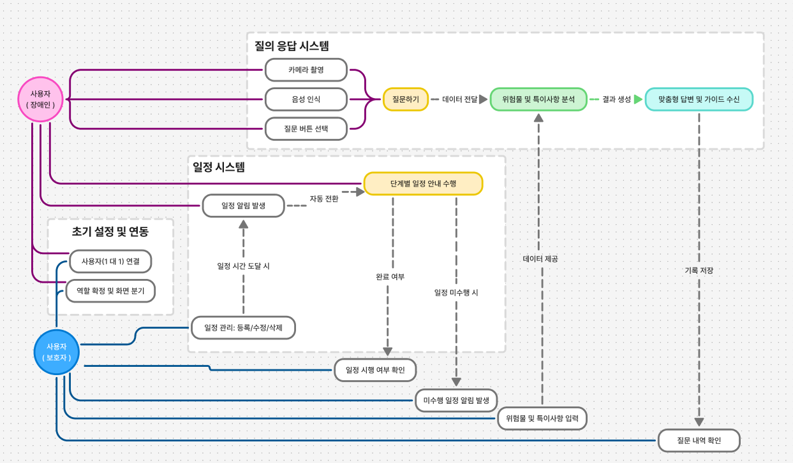
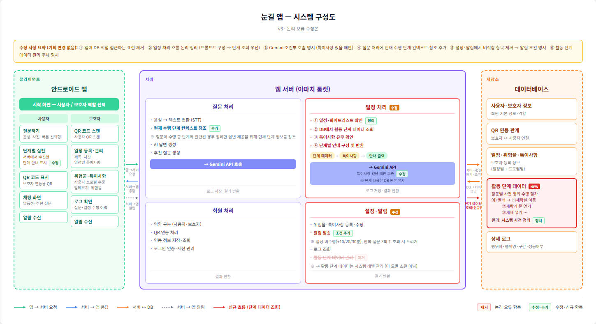
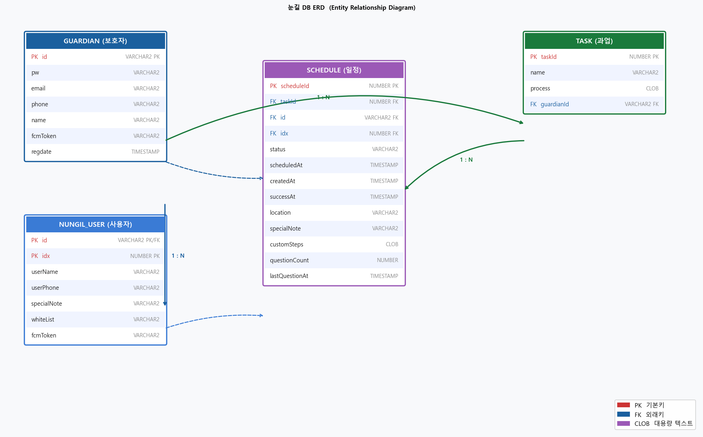

# 👁️ 눈길 (Nungil)

### 지적장애인과 보호자를 잇는 **AI 일상 지원 앱**

AI 어시스턴트 **똘똘이**가 일상 과업을 한 단계씩 음성으로 안내하고,  
보호자가 원격에서 일정을 등록·관리·모니터링합니다.

 

**[📱 APK 다운로드](https://github.com/Winni-Lina/nungil/releases/latest)** · **[📖 실행 가이드](INSTALL.md)** · **[📄 기술 보고서](기술보고서.md)** · **[📊 발표자료](발표자료/눈길_발표자료.pdf)** · **[📝 논문](논문/눈길_논문.docx)**

---

## 서비스 소개

중등도 지적장애인은 손씻기, 빨래, 외출 준비처럼 익숙해 보이는 일도 다음 단계가 떠오르지 않으면 멈춰버린다. 보호자는 하루에도 수차례 "이거 어떻게 해?"라는 전화를 받고, 옆에서 하나씩 알려줘야 한다.

기존 보조 앱은 정해진 동영상이나 카드를 보여주는 수준이었다. 사람마다 다른 인지 수준, 장소, 특이사항을 반영한 맞춤 안내는 없었다. 보호자가 등록한 일정에 AI가 맞춤 단계를 자동으로 만들고, 사용자는 "똘똘아"라는 웨이크워드 하나로 AI와 음성 대화하며 과업을 완수한다 — 눈길이 만들려는 것이다.

---

## 서비스 흐름

**보호자 쪽**
1. 앱에서 일정 등록 → 과업·장소·특이사항 입력
2. AI가 맞춤 단계 자동 생성 → 보호자가 검토·수정·확정
3. 사용자가 일정 수행 중 막히면 FCM 알림으로 즉시 파악
4. 수행 완료 후 리포트로 진행 상황 확인

**사용자(지적장애인) 쪽**
1. "똘똘아" 한 마디 → AI 어시스턴트 활성화
2. 음성으로 현재 단계 안내 받기
3. "했어", "응", "됐어" 등 자연어로 말하면 자동으로 다음 단계
4. 모르면 물어보기, 사진 찍어서 확인받기

---

## 핵심 설계 원칙 — AI를 통제한다

생성형 AI는 강력하지만 비결정적이다. 지적장애 사용자에게는 "똑똑하지만 가끔 틀리는" 것보다 **"예측 가능하고 일관된"** 것이 훨씬 중요하다.

눈길은 AI 역할을 의도적으로 제한한다.

| 항목 | 변경 전 | 변경 후 |
|------|---------|---------|
| **단계 출처** | 공통 고정 가이드 (개인화 없음) | 등록 시 AI가 맞춤 생성 → DB 저장 → 보호자 검토 |
| **완료 판단** | AI가 판단 (오판 잦음) | **앱이 키워드 직접 감지** (결정적) |
| **프롬프트 구조** | 단일 프롬프트 (규칙이 입력에 섞임) | system / user 분리 (일관성 향상) |

> AI는 **'맞춤 단계 생성'과 '안내·대응'** 만 담당한다. 흐름 제어와 완료 판단은 앱이 직접 처리한다.

---

## AI 파이프라인

AI(Gemini)는 딱 세 시점에만 호출된다.

| 호출 | 시점 | 역할 |
|------|------|------|
| **단계 생성** | 보호자 일정 등록 시 1회 | 과업 + 장소 + 특이사항 → 맞춤 단계 |
| **대화 응답** | 자유 채팅 | 질문 답변 + 사진 필요 여부 판단 |
| **일정 안내** | 수행 중 매 발화 | 현재 단계 안내 + 4분류 대응 |

### 프롬프트 엔지니어링

| 기법 | 효과 |
|------|------|
| `system_instruction` / `user` 역할 분리 | 규칙 준수·일관성·프롬프트 인젝션 저항 |
| `responseSchema` 구조화 출력 | JSON 4필드 강제 반환 → 파싱 안정성 |
| `responseMimeType=application/json` | 마크다운 펜스 없이 순수 JSON |
| `thinkingBudget=0` | 내부 추론 비활성 → 지연·비용 절감 |
| `maxOutputTokens=512` | 짧은 답변 강제 (사용자 특성 고려) |

### 사용자 발화 4분류

앱이 먼저 완료 키워드(정확 일치 5개 + 포함 9개)를 확인하고, 그 외는 AI가 분류해 대응한다.

---

## 선행 연구 근거

| 흐름 | 대표 연구 | 결과 |
|------|-----------|------|
| 단방향 단계별 지시 | Mechling et al.(2009), Cannella-Malone et al.(2013), Lancioni et al.(2017) | 과업 정확도·자발적 시작률 현저히 향상 (0~20% → 93~100%) |
| 양방향 음성 상호작용 | Smith et al.(2023) *semi-RCT, n=44* | 지적장애인이 AI 음성 대화에 적응 가능, 자율성 향상 |

눈길은 이 두 흐름을 생성형 AI로 결합한다 — 단계별 지시 + 과업 중 질문 응답 + 실시간 AI + 보호자 일정 연동.

---

## 시스템 아키텍처

하나의 Android APK 안에 보호자 앱과 사용자 앱이 공존하며, 서버는 Spring(WAR) 기반으로 Gemini · STT · FCM · Oracle과 연동한다.

### 일정 데이터 흐름

---

## 주요 기능

| 기능 | 설명 |
|------|------|
| 🔐 보호자 회원가입 · 로그인 | 아이디 중복확인, 임시 비밀번호 발급 |
| 📋 일정 등록 + AI 단계 자동 생성 | 맞춤 단계 생성 → 보호자 검토·편집·확정 |
| 📱 QR 1:1 페어링 | 보호자 QR 발급 → 사용자 스캔으로 연동 |
| 🗣️ "똘똘아" 웨이크워드 | Vosk 온디바이스, 오프라인 동작 |
| 🎧 단계별 음성 안내 | Google STT + TTS, 한 번에 한 단계 |
| ✅ 완료 키워드 감지 | "했어 / 응 / 됐어" → 자동 다음 단계 |
| 📷 카메라 멀티모달 | 사진 촬영 → Gemini 분석 → 음성 답변 |
| 🔔 FCM 실시간 알림 | 미수행·반복질문 발생 시 보호자 즉시 통보 |
| 📊 수행 리포트 | 일별 완료율 · 14일 과업 추세 |

---

## 알람 다층 안전망

지적장애 사용자에게 알람 누락은 곧 일정 실패다.

- **1차** `AlarmManager.setExactAndAllowWhileIdle` — Doze 모드 관통 정시 발동
- **2차** WorkManager 15분 주기 — 지연 구간 "늦은 알림" 백업
- **3차** 재부팅 복구 — 즉시 sync + 주기 워커 재등록
- **유령 알람 정리** — 삭제된 일정의 알람 동기화 시 자동 취소

---

## E2E 시나리오

| 서비스 시작 및 연동 | 일정 등록 및 수행 |
|:---:|:---:|
|  |  |
| **자유 시간 질문** | **보호자 알림 및 보고서** |
|  |  |

---

## 설계 문서

| 메뉴 구성도 | 유스케이스 | 시스템 구성도 |
|:---:|:---:|:---:|
|  |  |  |

- **SRS**: [눈길_통합SRS_v3_0.xlsx](https://github.com/user-attachments/files/28619923/_.SRS_v3_0.xlsx)
- **ERD**:

---

## 기술 스택

| 영역 | 기술 |
|------|------|
| 클라이언트 | Android (Kotlin), OkHttp, Vosk, AlarmManager, WorkManager, Firebase FCM |
| 서버 | Java, Spring MVC, MyBatis, Apache Tomcat 10.1, Maven |
| 데이터베이스 | Oracle |
| AI | Google Gemini 2.5 Flash (Vertex AI REST) |
| 음성 | Google Cloud Speech-to-Text + Android SpeechRecognizer |
| 인증 · 푸시 | Firebase Admin SDK / Cloud Messaging |

---

## 테스트

서버 핵심 로직 대상 **28개 전부 통과**.

| 종류 | 검증 대상 | 개수 |
|------|-----------|------|
| 단위 테스트 (JUnit 5) | 프롬프트 구조, 완료 키워드 판단, 서비스 위임 | 20 |
| E2E 테스트 (MockMvc) | HTTP 요청→응답 시나리오 | 5 |
| AI 통합 테스트 | 실제 Gemini 호출 (조건부 실행) | 3 |

커버리지: AI 파이프라인 54% · 보호자 도메인 53%

AI 프롬프트 실호출 검증: **8개 시나리오 중 7개 통과 (87.5%)** → [검증 결과 상세](기술보고서.md#52-ai-프롬프트-성능-평가-실-서버-직접-호출)

---

## 실행하기

APK 한 번에 설치하거나, 소스에서 직접 빌드하는 방법 모두 **[INSTALL.md](INSTALL.md)** 에 정리되어 있습니다.

**빠른 설치**: [Releases](https://github.com/Winni-Lina/nungil/releases/latest)에서 `Nungil-v1.0.apk` 다운로드 → 설치 → 실행

---

## 프로젝트 자료

이 저장소의 주요 문서와 용도입니다. 목적에 맞는 자료부터 보시면 됩니다.

| 자료 | 설명 | 이런 분께 |
|---|---|---|
| **[📱 APK](https://github.com/Winni-Lina/nungil/releases/latest)** | 바로 설치해 실행하는 안드로이드 앱. 팀 서버에 연결되어 별도 설정 없이 동작합니다. | 앱을 곧바로 써보고 싶은 분 |
| **[📖 실행 가이드 (INSTALL.md)](INSTALL.md)** | 소스에서 서버·앱을 처음부터 빌드·실행하는 단계별 가이드. 키 발급·DB 스키마·ngrok·Vosk 모델까지 포함합니다. | 직접 환경을 구축해 돌려보려는 분 |
| **[📄 기술 보고서 (기술보고서.md)](기술보고서.md)** | 개요·문제 정의·설계·구현·테스트·개발 과정의 전환까지 담은 최종 기술 문서. 프로젝트 전체를 이해하는 중심 자료입니다. | 프로젝트를 깊이 파악하려는 분 |
| **[📊 발표자료 (PDF)](발표자료/눈길_발표자료.pdf)** | 발표용 슬라이드 34장. 문제 정의부터 시연 화면·성능 평가까지 그림 중심으로 요약했습니다. | 짧은 시간에 전체 그림을 보고 싶은 분 |
| **[📝 논문 (DOCX)](논문/눈길_논문.docx)** | 학술 논문. 돌봄 부담 통계와 선행 연구 근거, 서비스 모델을 학술 형식으로 정리했습니다. | 근거·배경을 확인하려는 분 |

> 처음 오셨다면 **README → 기술 보고서 → 실행 가이드** 순서를 추천합니다.

---

**눈길 팀** · 한국폴리텍대학 성남캠퍼스 · 한이음 드림업 · 2026

