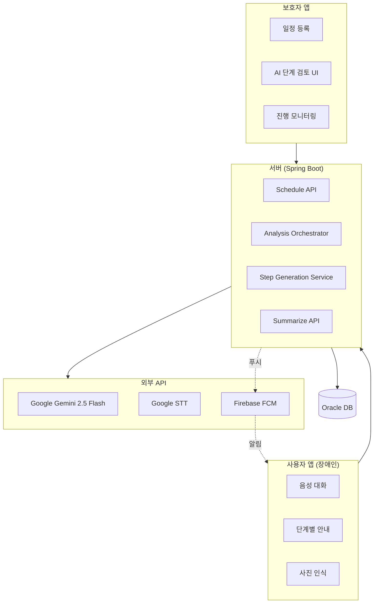
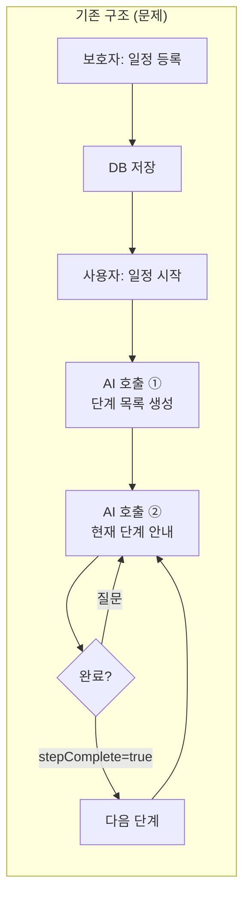
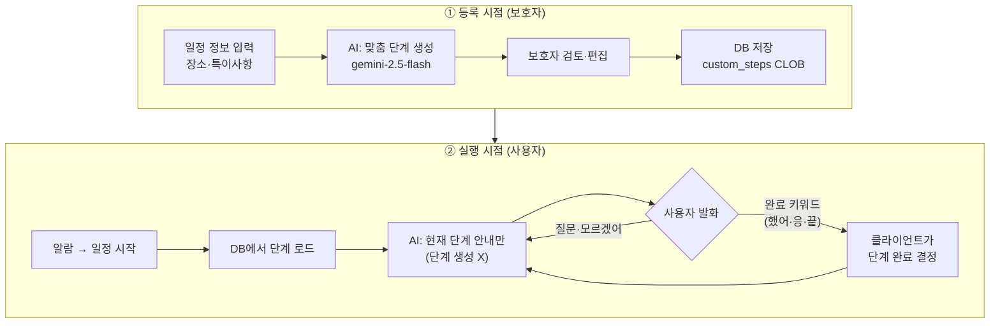
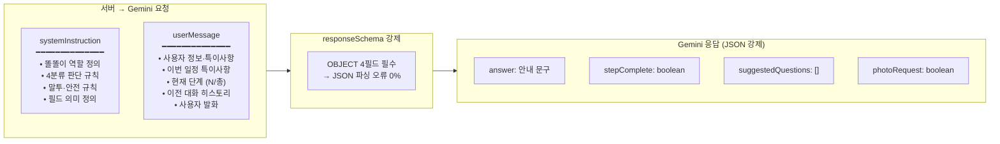
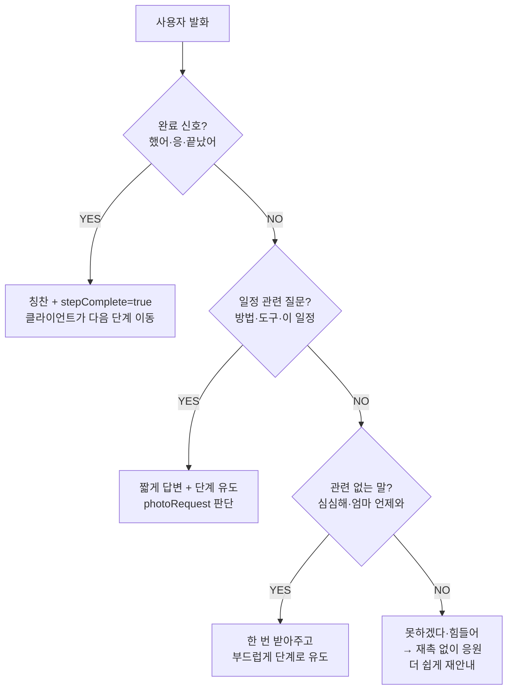

# 눈길 시스템 아키텍처

발표용 시각 자료. GitHub/타입ora/Mermaid Live Editor 등에서 렌더링.

---

## (A) 시스템 구성도

---

## (B) AI 구조 변경 Before / After

### ❌ 기존 구조 (문제점)

**문제:**
- 실행 때마다 AI가 단계 목록을 새로 만듦 → 매번 다른 단계, 사용자 혼란
- 단계 완료 판단을 AI가 함 → 보호자가 통제 불가
- AI 호출이 2중으로 발생 → 응답 지연, 비용↑

---

### ✅ 현재 구조 (개선)

**개선점:**
- 단계는 **등록 시 1회만** 생성 → 일관성 보장
- 보호자가 직접 검토·수정 가능
- 실행 시 AI는 **안내만** → 빠른 응답
- **단계 완료 판단은 클라이언트** (키워드 감지) → AI 오판 없음

---

## (C) 프롬프트 구조 (System / User 분리)

### 4분류 판단 로직 (일정 수행 모드)

---

## (D) 기존 vs 현재 구조 비교표

| 항목 | 기존 | 현재 |
|---|---|---|
| 단계 생성 시점 | 실행 때마다 AI 생성 | 등록 시 1회 생성 |
| 보호자 검토 | 불가 | ✅ 검토·편집 후 저장 |
| 단계 완료 판단 | AI (stepComplete) | 클라이언트 키워드 감지 |
| AI 역할 | 단계 생성 + 안내 | 안내만 |
| 프롬프트 구조 | 단일 prompt | system / user 분리 |
| 응답 형식 | 텍스트 파싱 | responseSchema JSON 강제 |
| 모델 | gemini-2.5-flash | gemini-2.5-flash |
| 단계 일관성 | 매번 달라짐 | 항상 동일 (DB 저장) |
