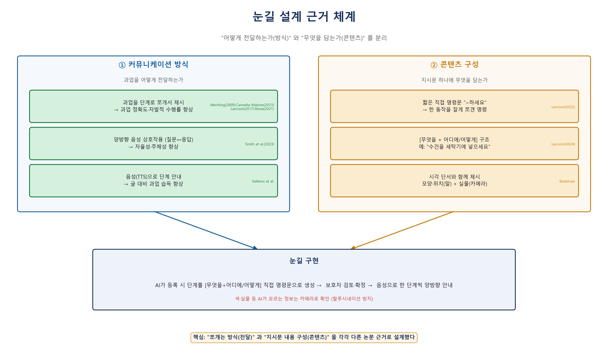
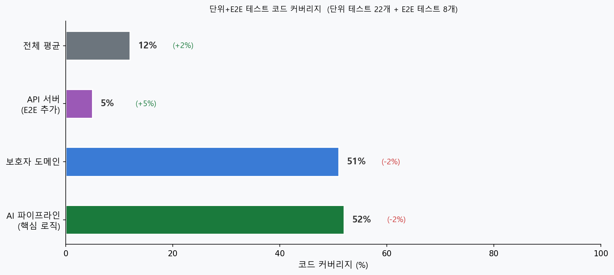

# 눈길(Nungil) Technical Report

**프로젝트명**: 눈길 — 지적장애인 생활보조 AI 어시스턴트
**소속**: 한국폴리텍대학 성남캠퍼스 · 한이음 드림업 프로젝트
**팀원**: 김동호 · 김유진 · 김광진 (지도: 이지유)
**개발 기간**: 2026년 3월 ~ 7월
**리포지토리**: https://github.com/Winni-Lina/nungil

---

## 목차

1. [프로젝트 개요](#1-프로젝트-개요)
2. [서비스 개요](#2-서비스-개요)
3. [요구사항 정의](#3-요구사항-정의)
4. [아키텍처 설계](#4-아키텍처-설계)
5. [주요 기술](#5-주요-기술)
6. [테스트 결과](#6-테스트-결과)
7. [프로젝트 결과 분석](#7-프로젝트-결과-분석)
8. [개인별 학습 성과](#8-개인별-학습-성과)
- [참고 문헌](#참고-문헌)

---

## 1. 프로젝트 개요

### 1.1 프로젝트 주제

눈길은 지적장애가 있는 사용자가 빨래·설거지·손씻기 같은 일상 과업을 스스로 끝까지 수행하도록, AI 어시스턴트 **"똘똘이"** 가 음성으로 한 단계씩 안내하는 앱이다. 보호자는 원격에서 일정을 등록하고 AI가 생성한 단계를 검토하며, 사용자의 수행 상황을 모니터링한다. 하나의 Android 앱 안에 **보호자 앱**과 **사용자 앱**이 공존하고, 서버는 Gemini·STT·FCM·Oracle과 연동한다.

### 1.2 프로젝트 선정 이유

지적장애인은 반복적인 일상 활동도 단계 순서를 혼자 기억하고 수행하기 어렵다. 익숙해 보이는 일도 다음 동작이 떠오르지 않으면 그 자리에서 멈춰버린다. 보호자가 항상 옆에 있을 수는 없고, 하루에도 수차례 "이거 어떻게 해?"라는 질문에 응대해야 하는 부담이 있다.

같은 "빨래 해야지"라는 상황에서 두 사람이 겪는 경험은 전혀 다르다.

| 구분 | 일반인 | 중등도 지적장애인 |
|---|---|---|
| 과업 시작 | "빨래 해야지" | "빨래 해야지" |
| 진행 | 알아서 다음 단계로 | "어떻게 하지?" — 중간에 순서를 잊어버림 |
| 결과 | 완료 | 포기하거나 보호자 호출 |

즉 핵심 문제는 ① **단계를 기억하지 못함**, ② **방법을 몰라도 물어보기 어려움**, ③ **스스로 끝까지 할 책임감·지속성 부족** 세 가지로 요약된다. 의학적으로도 중등도 지적장애(IQ 35~55)는 행동을 순서대로 계획·실행하는 **실행 기능**과 여러 단계를 짧게 기억하는 **작업 기억**의 제한으로 설명된다(DSM-5).

이 문제는 당사자 개인에서 그치지 않고 가족 전체로 번진다. 발달장애인 가족의 **40.4%가 평일 하루 10시간 이상**을 돌봄에 쓰고, 보호자의 **40.7%가 최근 1년 내 정신과 진료**를 받았으며 **25.9%는 자살을 생각**한 적이 있다. 국가의 장애인활동지원서비스조차 실제 이용률이 **11.7%**에 그치고 이용자의 **55.4%가 지원 시간이 부족**하다고 답해, 야간·공휴일의 돌봄 공백이 고스란히 가족의 몫으로 남는다.[1][2][3]

기존 보조 앱들은 정해진 동영상·카드를 보여주는 수준에 머물러, 사람마다 다른 인지 수준·장소·특이사항을 반영하지 못했다. "음성으로 한 단계씩 안내하고, '됐어요' 한 마디로 다음 단계로 넘어가는 AI 보조 도구가 있다면 자립을 도울 수 있다"는 것이 프로젝트의 출발점이었다. 이 접근은 임의적 기획이 아니라 선행 연구(5.6절)에서 효과가 입증된 방식을 생성형 AI로 결합한 것이다.

### 1.3 개발 환경

| 구분 | 내용 |
|---|---|
| **사용 언어** | Kotlin (Android 클라이언트), Java (서버) |
| **클라이언트** | Android SDK, Android Studio, OkHttp, Vosk(오프라인 STT), AlarmManager, WorkManager, ZXing(QR), Firebase FCM |
| **서버** | Spring MVC, MyBatis, Apache Tomcat 10.1, Maven, JUnit 5 |
| **데이터베이스** | Oracle |
| **AI / 외부 API** | Google Gemini 2.5 Flash (Vertex AI REST), Google Cloud Speech-to-Text, Firebase Cloud Messaging |
| **개발 도구** | Android Studio, Eclipse(Tomcat), Git/GitHub, ngrok(외부 터널링) |
| **실행 방식** | 서버(WAR)를 Tomcat에 배포 → ngrok으로 외부 노출 → Android 앱이 REST로 통신. 상세 절차는 [INSTALL.md](INSTALL.md) 참고 |

### 1.4 프로젝트 여정 — 두 번의 기획 폐기와 주제 선정 기준

눈길은 처음부터 정해진 주제가 아니었다. 프로젝트 초기에 팀은 **두 번의 기획을 폐기**했다. 폐기 이유는 매번 비슷했다 — ① 팀의 기술 수준으로는 현실적으로 구현하기 어려웠고(구현 불가능성), ② 필요한 데이터를 어떻게 확보·검증할지 계획이 없었으며(데이터 불확실성), ③ 무엇이 성공이고 실패인지 판단할 기준 자체가 모호했다(기준 부재).

같은 실수를 반복하지 않기 위해, 팀은 다음 **네 가지 주제 선정 기준**을 세우고 이를 통과하는 주제만 채택하기로 했다.

| 기준 | 내용 |
|---|---|
| 목표의 정량화·검증 | 성공/실패를 수치로 측정할 수 있어야 함 (예: 인식률 90% 이상) |
| 기술적 실현 가능성 | 현재 기술 스택으로 3개월 내 구현 가능, 핵심 기술은 미리 소규모 검증 |
| 성과 시각화·전략적 가치 | 실제 동작하는 데모 + 사용자에게 실질적 도움 |
| 확장성·지속 가능성 | 종료 후에도 발전 여지 (모듈화·API 기반 설계) |

이 기준을 통과한 결과가 지금의 '눈길'이다. 두 번의 폐기는 시간 낭비가 아니라, 프로젝트를 **검증 가능하고 실현 가능한 문제**로 좁혀간 과정이었다.

---

## 2. 서비스 개요

### 2.1 서비스 설명

**핵심 기능.** 눈길은 두 개의 앱과 하나의 AI 파이프라인으로 구성된다.

1. 보호자가 일정(과업·시간·장소)을 등록하면, 서버 AI가 그 자리에서 쉬운 단계 5~10개를 생성한다.
2. 보호자가 단계를 검토·수정해 확정하면 DB에 저장되고, 사용자 기기로 FCM 푸시가 가면서 알람이 등록된다.
3. 알람 시간이 되면 사용자 앱이 안내하고, 사용자가 "똘똘아"를 부른 뒤 음성으로 대화한다.
4. AI는 현재 단계만 쉽게 안내하고, 사용자가 "다 했어"라고 하면 앱이 키워드를 감지해 다음 단계로 넘어간다.
5. 마지막 단계가 끝나면 완료 처리되고, AI가 수행 내용을 요약해 보호자가 리포트로 확인한다.

**주요 사용자와 사용 상황.**

- **사용자(지적장애인)** — 집에서 혼자 일상 과업을 수행하는 상황. 글보다 음성 위주로 소통한다. 예) 오후 2시 "손씻기" 알람 → "똘똘아" 호출 → 단계별 안내를 들으며 수행.
- **보호자** — 직장·외출 등으로 곁에 없는 상황. 미리 일정을 등록해두고, 사용자가 막히거나 반복 질문하면 FCM 알림으로 상황을 파악한다.

### 2.2 주요 기능

#### Usecase Diagram

<div align="center">


</div>

> **[그림 2-1] 유스케이스 다이어그램.** 보호자는 회원가입·일정 등록·단계 검토·리포트 확인을, 사용자는 QR 연동·음성 대화·단계 수행·사진 질문을 수행한다. 서버는 두 액터의 요청을 받아 Gemini·STT·FCM과 연동한다.

#### 기능별 설명

| 기능 | 설명 |
|---|---|
| 보호자 회원가입 · 로그인 | 아이디 중복확인, 임시 비밀번호 발급, 계정 관리 |
| 일정 등록 + AI 단계 자동 생성 | 과업·장소·특이사항 입력 → Gemini가 맞춤 단계 생성 → 보호자 검토·편집·확정 |
| QR 1:1 페어링 | 보호자가 QR 발급 → 사용자 앱에서 스캔하면 연동 완료 |
| "똘똘아" 웨이크워드 | Vosk 온디바이스 STT, 인터넷 없이 동작 |
| 단계별 음성 안내 | Google Cloud STT로 음성 입력 → Gemini 응답 → TTS 출력 |
| 완료 키워드 감지 | "했어 / 응 / 됐어" 등 14종 → 앱이 감지해 자동으로 다음 단계 |
| 카메라 멀티모달 질문 | "이만큼이면 돼?" → 사진 촬영 → Gemini 시각 분석 → 음성 답변 |
| FCM 실시간 알림 | 미수행·반복 질문 발생 시 보호자에게 푸시 |
| 일정 완료 후 AI 요약 | 수행 결과를 보호자 앱 리포트에서 확인 |
| 수행 리포트 | 일별 완료율, 14일 과업 추세 차트 |

#### 사용자 유형 설명

| 유형 | 특징 | 앱에서의 역할 |
|---|---|---|
| **사용자 (지적장애인)** | 중등도 지적장애. 단계 순서 기억·완료 판단이 어려움. 음성 소통 선호 | 웨이크워드 호출, 음성 대화, 단계 수행, 사진 질문 |
| **보호자** | 사용자를 돌보는 가족·시설 종사자 | 일정 등록, AI 단계 검토·수정, 원격 모니터링, 리포트 확인 |

### 2.3 메뉴구성도

<div align="center">


</div>

> **[그림 2-2] 메뉴 구성도.** 첫 실행 시 역할(보호자/사용자)을 선택해 분기한다. 보호자 앱은 로그인 → 사용자 관리·일정·리포트·설정으로, 사용자 앱은 QR 연동 → 채팅(음성 대화)·오늘 일정·알림·설정으로 구성된다.

### 2.4 User Flow (End-to-End 시나리오)

| 시나리오 1 — 서비스 시작 및 연동 | 시나리오 2 — 일정 등록 및 수행 |
|:---:|:---:|
|  |  |
| 시나리오 3 — 자유 시간 질문 | 시나리오 4 — 보호자 알림 및 보고서 |
|  |  |

> **[그림 2-3] E2E 시나리오.** ① 보호자 회원가입 → QR 발급 → 사용자 스캔으로 연동, ② 일정 등록 → AI 단계 생성 → 사용자 음성 수행, ③ 자유 시간에 사진 기반 질문 응답, ④ 미수행·반복질문 시 보호자 알림 및 완료 리포트까지의 전체 흐름을 보여준다.

### 2.5 페르소나 및 벤치마킹

눈길은 서로 맞물린 두 사용자를 대상으로 설계했다. 지적장애 당사자(사용자)와 그를 돌보는 보호자다.

**페르소나 ① 사용자 — 김민수 (24세, 중등도 지적장애).** 특징은 *인지적 병목 · 수동적 일상 · 자립의 공백*으로 요약된다.

- 라면을 끓이려고 물을 올렸지만, 물이 끓는 사이 '스프 넣기'라는 다음 순서를 잊어버린다.
- 배가 고프다는 욕구는 있지만 '냉장고 확인 → 음식 선택 → 가열'이라는 계획을 스스로 세우지 못한다.
- 전자레인지에 알루미늄 호일을 넣거나 뜨거운 냄비를 맨손으로 잡으려는 등 안전 위험에 노출된다.

→ 눈길은 과업을 한 단계씩 쪼개 음성으로 안내하고, 위험물·특이사항을 보호자가 등록하도록 해 이러한 병목과 위험을 보완한다.

**페르소나 ② 보호자 — 박영희 (52세).** 특징은 *돌봄의 무게 · 심리적 감옥*으로 요약된다.

- 주중 평균 하루 10시간 이상을 아들 민수의 ADL(식사·세면·안전 확인) 보조에 투입한다.
- 아들이 혼자 있을 때 '순서의 잊음'이나 '돌발 사고'에 대한 불안으로 업무 중에도 휴대폰을 놓지 못한다.

→ 눈길은 보호자가 미리 일정을 등록해두면 AI가 곁에서 안내하고, 미수행·반복 질문 시 FCM으로 상황을 알려 보호자의 상시 대기 부담을 덜어준다.

**유사 서비스 벤치마킹.**

| 구분 | 기존 보조 앱 | 범용 AI 스피커 | 눈길 |
|---|---|---|---|
| 안내 방식 | 고정 동영상·카드 | 자유 대화 | AI 맞춤 단계 + 음성 안내 |
| 개인화 | 없음 | 제한적 | 장소·특이사항 반영 맞춤 생성 |
| 완료 판단 | 사용자 스스로 | 없음 | 앱 키워드 감지(결정적) |
| 보호자 연동 | 없음/약함 | 없음 | 일정 등록·검토·리포트 |

---

## 3. 요구사항 정의

> 전체 요구사항 명세는 [문서/눈길_SRS_v3.0.xlsx](문서/눈길_SRS_v3.0.xlsx)(통합 SRS v3.0)에 정리되어 있으며, 아래는 핵심 요약이다.

### 3.1 기능 요구사항

| ID | 요구사항 | 우선순위 |
|---|---|---|
| FR-01 | 보호자는 회원가입·로그인하고 계정을 관리할 수 있다 | 필수 |
| FR-02 | 보호자는 QR을 발급하고 사용자는 스캔으로 1:1 연동한다 | 필수 |
| FR-03 | 보호자는 과업·시간·장소·특이사항으로 일정을 등록한다 | 필수 |
| FR-04 | 시스템은 등록 시점에 AI로 맞춤 단계(5~10개)를 생성한다 | 필수 |
| FR-05 | 보호자는 생성된 단계를 검토·편집·확정할 수 있다 | 필수 |
| FR-06 | 사용자는 "똘똘아" 웨이크워드로 어시스턴트를 호출한다 | 필수 |
| FR-07 | 시스템은 현재 단계를 음성(TTS)으로 안내한다 | 필수 |
| FR-08 | 시스템은 완료 키워드를 감지해 다음 단계로 진행한다 | 필수 |
| FR-09 | 사용자는 사진을 찍어 사물에 대해 질문할 수 있다 | 선택 |
| FR-10 | 일정 시각에 알람이 발동하고, 놓친 경우 늦은 알림을 준다 | 필수 |
| FR-11 | 미수행·반복 질문 시 보호자에게 FCM 알림을 보낸다 | 필수 |
| FR-12 | 완료 시 AI가 수행 내용을 요약해 리포트로 제공한다 | 선택 |

### 3.2 비기능 요구사항

| ID | 항목 | 요구사항 |
|---|---|---|
| NFR-01 | 신뢰성 | 알람은 Doze 모드·재부팅에도 발동해야 한다(다층 안전망) |
| NFR-02 | 안정성 | AI 응답 파싱 실패 시에도 앱은 항상 유효한 응답을 받아야 한다(3중 폴백) |
| NFR-03 | 접근성 | 한 문장 15자 이내, 큰 버튼·굵은 글씨 등 지적장애 사용자 배려 |
| NFR-04 | 일관성 | 같은 과업은 매번 동일한 단계로 안내되어야 한다(단계 DB 저장) |
| NFR-05 | 응답성 | AI 응답 지연 최소화(thinkingBudget=0, maxOutputTokens=512) |
| NFR-06 | 오프라인성 | 웨이크워드 감지는 네트워크 없이 동작해야 한다(Vosk) |
| NFR-07 | 보안 | API 키·서비스 계정 키는 저장소에 커밋하지 않는다(.gitignore) |

---

## 4. 아키텍처 설계

### 4.1 시스템 구성도

하나의 Android APK 안에 보호자 앱과 사용자 앱이 공존하며, `RoleSelectActivity`에서 역할을 분기한다. 서버는 전통적 Spring(WAR) 방식이고, 외부로 Google Gemini·STT, Firebase FCM, Oracle DB와 연동한다.

<div align="center">


</div>

> **[그림 4-1] 시스템 구성도.** 클라이언트(보호자/사용자 앱) → 서버(API·Domain·Infra) → 외부(Gemini·STT·FCM·Oracle)의 계층 구조. 이 시스템은 로그인 세션 토큰(JWT 등)을 쓰지 않고, 매 요청에 담긴 `guardianId` + `userIdx`(보호자별 사용자 인덱스, 1:N)로 식별한다. QR에는 `{userId, userIdx}`가 담겨 1:1 페어링에 쓰인다.

**계층별 책임**

| 영역 | 구성 | 책임 |
|---|---|---|
| 클라이언트 | 보호자 앱 / 사용자 앱 / 공용 core | UI, 음성, 알람 등록, FCM 수신, 서버 통신 |
| 서버 API | Guardian / Nungil 컨트롤러 | HTTP 요청 수신, 검증, 응답 |
| 서버 Domain | Service + MyBatis Mapper | 비즈니스 로직, DB 접근 |
| 서버 Infra | google / firebase / scheduler | AI·STT 호출, 푸시 발송, 주기 검사 |
| 외부 | Gemini · STT · FCM · Oracle | AI 응답, 음성 인식, 푸시, 영속 저장 |

**일정 데이터 흐름**

<div align="center">


</div>

> **[그림 4-2] 일정 데이터 흐름.** 보호자 등록 → AI 단계 생성 → DB 저장 → FCM 푸시 → 사용자 알람 등록 → 수행 → 완료 처리 → 리포트까지, 하나의 일정이 두 앱과 서버를 오가는 전 과정을 나타낸다.

### 4.2 프로젝트 파일 구조

**서버 패키지 (`com.nungil`)**

| 패키지 | 역할 | 주요 클래스 |
|---|---|---|
| `api.guardian.*` | 보호자 앱용 컨트롤러 | GuardianAuthController, ScheduleController, ReportController, NungilUserController |
| `api.nungil.*` | 사용자 앱+공용 컨트롤러 | NungilApiController, NungilAnalyzeController |
| `domain.*` | 도메인(VO+Service+Mapper) | guardian / user / schedule / task |
| `infrastructure.google` | AI 파이프라인 | GeminiRestAdapter, AnalysisOrchestrator, StepGenerationService, GoogleSttClient |
| `infrastructure.firebase` | 푸시 | FcmService |
| `infrastructure.scheduler` | 주기 작업 | NungilScheduler |
| `common` | 공통 | ApiLoggingInterceptor, WebConfig |

**Android 앱 구조 (`com.example.myapplication`)**

| 패키지 | 역할 |
|---|---|
| `guardian.onboarding` | 로그인·회원가입·비번찾기·화이트리스트 챗봇·특이사항 |
| `guardian.qr` | QR 발급 (사용자 연동) |
| `guardian.schedule` | 일정 목록·등록·AI 단계 생성·타임라인 |
| `guardian.report / notification / settings` | 리포트·알림 다이얼로그·설정 |
| `user.qr / chat / schedule / main` | QR 스캔, 메인 채팅, 일정·알람, 탭 화면 |
| `core.network / fcm / manager` | ApiClient·Session, FCM 수신, Vosk·TTS 매니저 |

### 4.3 ERD

<div align="center">


</div>

> **[그림 4-3] ERD.** `GUARDIAN`(보호자) 1 : N `NUNGIL_USER`(사용자) 1 : N `SCHEDULE`(일정) 구조이며, `SCHEDULE`은 `TASK`(과업 마스터)를 참조한다. 별도의 대화 로그 테이블을 두지 않고, 반복 질문 추적은 `SCHEDULE`의 `question_count`·`last_question_at` 컬럼으로 처리한다. (실제 스키마는 [`server/src/main/resources/schema.sql`](server/src/main/resources/schema.sql) 참고)

| 테이블 | 핵심 컬럼 | 설명 |
|---|---|---|
| `GUARDIAN` | id(PK), pw, email, phone, name, fcm_token, regdate | 보호자 계정 |
| `NUNGIL_USER` | id(FK), idx, special_note(CLOB), white_list(CLOB), user_name, user_phone, fcm_token | 보호자별 사용자. 복합 PK(id, idx). `idx = NVL(MAX(idx),0)+1`로 채번 |
| `TASK` | task_id(PK), name, process(CLOB) | 과업 마스터. 기본 단계 가이드 |
| `SCHEDULE` | schedule_id(PK), task_id(FK), id/idx(FK), status, scheduled_at, created_at, success_at, location, special_note, custom_steps(CLOB), question_count, last_question_at | status = pending/completed/abandoned. custom_steps = AI 생성 맞춤 단계 JSON. question_count·last_question_at으로 반복질문 추적 |

---

## 5. 주요 기술

### 5.1 AI 파이프라인 — Gemini 호출과 프롬프트 설계

프로젝트에서 가장 핵심적인 부분이다. AI(Gemini)는 딱 세 시점에만 호출되며, 흐름 제어는 전부 앱이 가진다.

| 호출 | 시점 | 스키마 | 역할 |
|---|---|---|---|
| 단계 생성 (`generateSteps`) | 보호자 일정 등록 시 1회 | STEPS_SCHEMA `ARRAY<STRING>` | 과업+장소+특이사항 → 맞춤 단계 |
| 대화 응답 (`sendRequest`) | 자유 채팅 | CHAT_SCHEMA | 질문 답변 + 사진 필요 판단 |
| 일정 안내 (`sendRequest`) | 수행 중 매 발화 | CHAT_SCHEMA | 현재 단계 안내 + 4분류 대응 |

**응답 안정화 설정.** `generationConfig`에 다음을 적용해 형식 깨짐을 구조적으로 막는다.

```
responseMimeType = application/json   // JSON 강제 → 파싱 안정
responseSchema   = 고정 스키마         // 응답 구조를 4필드로 고정
maxOutputTokens  = 512                // 짧은 답변 보장
thinkingBudget   = 0                  // 내부 추론 비활성 → 지연·비용 절감
```

CHAT_SCHEMA는 `{ answer, stepComplete, suggestedQuestions, photoRequest }` 4필드로 고정되어, 서버는 응답을 그대로 파싱할 수 있다.

### 5.2 AI를 통제하는 설계 — 완료 판단과 환각 통제

핵심 설계 철학은 **"AI에게 모든 판단을 맡기지 않는다"** 이다.

단계는 보호자가 일정을 등록할 때 AI가 한 번 생성해 DB에 저장하고 보호자가 검토·확정한다. 수행 중에는 이 고정 단계를 순서대로 안내할 뿐이고, 다음 단계로 넘어갈지는 앱이 결정한다. "다 했어", "됐어" 등 14종의 완료 키워드를 앱이 직접 감지하므로, "이거 다 했는데 맞아?" 같은 질문형을 완료로 오인하는 문제가 없다.

AI가 직접 개입하는 구간은 세 시점뿐이다 — 일정 등록 시 단계 생성(1회), 수행 중 안내·질문 응답(매 발화), 자유 시간 채팅. 흐름 제어와 완료 판단은 앱이 직접 처리한다.

환각을 완전히 없앤 것이 아니라 **영향 범위를 통제**한 설계다. 단계 자체는 보호자가 검토한 고정값이고, 안내 답변의 내용 환각은 프롬프트 안전 규칙·출력 스키마 강제·보호자 검토가 함께 막는다.

### 5.3 프롬프트 엔지니어링 — system / user 분리

교수님 피드백을 반영해, 이전에는 역할·규칙·데이터·질문을 한 덩어리 문자열로 보내던 방식을 Gemini의 `system_instruction`과 `user` 메시지로 분리했다.

- **system** = 역할 · 행동 규칙 · 출력 JSON 형식 (고정)
- **user** = 사용자 정보 · 특이사항 · 현재 단계 N/M · 이전 대화 · 질문 (가변)

이로써 규칙이 입력 데이터에 묻히지 않아 규칙 준수·응답 일관성·프롬프트 인젝션 저항이 향상됐다.

**일정 프롬프트의 4분류 로직.** 일정 수행 중 모든 발화를 4가지로 분류해 행동을 결정한다.

```
① 완료 신호 ("다 했어","됐어" 등)      → 짧게 칭찬, stepComplete=true
② 일정 관련 질문 (방법/도구/일정 자체)   → 짧게 답하고 현재 단계로 복귀
                                        (사물 확인 필요 시 photoRequest=true)
③ 일정과 관련 없는 말 ("엄마 언제 와?")  → 한 번 받아준 뒤 단계로 유도
④ 못 하겠다·힘들어함                    → 재촉 없이 응원하며 더 쉽게 재안내
```

<div align="center">


</div>

> **[그림 5-2] 사용자 발화 처리 흐름.** 앱이 먼저 완료 키워드(정확 5개 + 포함 9개, 총 14종)를 검사하고, 그 외 모든 말은 AI가 4분류로 처리한다. 완료 여부의 최종 결정권은 앱에 있다.

### 5.4 음성 처리 — 웨이크워드 · STT · TTS

| 단계 | 기술 | 특징 |
|---|---|---|
| 웨이크워드 감지 | Vosk (온디바이스) | "똘똘아"를 오프라인 상시 청취. "똑똑/돌돌" 등 미끼 단어(decoy)로 오인식 흡수. 화면 꺼짐 시 미반응(배터리 절약) |
| 명령 인식 | Android SpeechRecognizer (ko-KR) | 앱에서 1차 음성 인식 |
| 서버 인식 | Google Cloud STT | 서버 측 정밀 인식 |
| 응답 읽기 | Android TTS (Locale.KOREAN) | AI answer를 음성 출력 |

TTS(스피커)와 STT(마이크)가 서로를 듣는 에코 문제는 `isRecording`·`isSpeaking` 플래그로 직렬화하고, TTS 종료 후 0.6~1.2초 지연을 두어 회피한다.

### 5.5 알람 다층 안전망

지적장애 사용자에게 알람 누락은 곧 일정 실패다. 그래서 다층으로 방어한다.

<div align="center">


</div>

> **[그림 5-3] 알람 다층 안전망.** 정시 발동(1차)이 실패해도 주기 백업(2차)과 재부팅 복구(3차)가 순차적으로 방어한다.

- **1차** `AlarmManager.setExactAndAllowWhileIdle` — Doze 모드 관통 정시 발동
- **2차** WorkManager 15분 주기 — 5~60분 지연 구간 "늦은 알림" 백업
- **3차** 재부팅 복구 — BootReceiver가 즉시 sync + 주기 워커 재등록
- **유령 알람 정리** — 삭제된 일정의 알람을 동기화 시 자동 취소

### 5.6 설계 근거 — 선행 연구

<div align="center">



</div>

> **[그림 5-4] 설계 근거 체계.** 단방향 단계별 지시의 효과 + 양방향 음성 상호작용의 적용 가능성 = 눈길(두 방식의 최초 결합).

눈길의 설계는 임의 기획이 아니라, 지적장애인 대상 선행 연구에서 효과가 입증된 세 축 위에 서 있다.

**① 단방향 단계별 지시의 효과** — 눈길의 "단계 안내" 근거

| 연구 | 대상 · 방식 | 지시 형식 | 결과 |
|---|---|---|---|
| Mechling, Gast & Seid (2009) [5] | ASD 학생 3명 / 요리 과업 | PDA 사진+음성+영상 멀티미디어 자기촉진 | 과업 정확도 0~20% → **93~100%** |
| Cannella-Malone, Brooks & Tullis (2013) [6] | 중등도~중증 지적장애 청소년 4명 / 청소 과업 | iPod 터치 자기지시 앱, 비디오 촉진 | 정확도 0.6~1.4% → **66~100%** |
| Lancioni et al. (2017) [7] | 지적+감각장애 8명 | 시간 알림 + 그림/음성 지시 | 자발적 시작 **20%↑**, 정확도 **90%↑** |
| Resta et al. (2021) [8] | 지적·정신장애 인지저하 2그룹 | Easy Alarm 앱, 사진·녹음 오디오 지시 | 통계적으로 유의미한 향상 |

**② 양방향 음성 상호작용의 적용 가능성** — 눈길의 "AI 음성 대화" 근거

| 연구 | 내용 | 결과 |
|---|---|---|
| Smith, Summer, Hedge & Powell (2023) *semi-RCT* | 경도·중등도 지적장애인 22명 + 대조군 22명(n=44) / 12주 / Amazon Echo·Google Home 양방향 음성 상호작용 | 대부분 스스로 기기를 다루는 주체성(agency)을 갖게 됨, 자율성 향상, 상호작용 학습 가능 |

→ 지적장애인이 AI와 양방향 음성으로 상호작용하는 것이 가능하며 자율성이 향상됨을 직접 입증한다.

**③ 지시문 설계의 직접 근거** — 눈길 TTS 단계 지시문 형식의 정당성

| 근거 | 처방 내용 | 눈길 적용 |
|---|---|---|
| Lancioni (2022) | 한 동작을 다시 잘게 쪼갠 직접 명령문 ("~하세요") | TTS 단계 지시문을 동일 형식으로 |
| Lancioni (2024) | "무엇을 + 어디에/어떻게" 2부분 구조 | 지시문 구조 설계 근거 |
| Bradshaw | 맥락·시각 단서와 함께 제시 | 카메라로 본 상황 + 지시 결합(멀티모달) |
| Kellems et al. | 단계별 음성 지시가 과업 습득 향상 | 텍스트 + TTS 병행 정당화 |

→ "~하세요" 형식의 짧은 직접 명령문을 한 번에 한 단계씩 음성과 함께 제시하는 방식은, 지적장애인 대상 연구에서 실제로 쓰였고 효과가 검증된 설계다.

### 5.7 기타 핵심 기술

- **FCM 푸시** — 일정 시각 도래, 미수행, 반복 질문 시 보호자/사용자에게 알림.
- **3중 폴백** — STT 빈값 → "…" 대체 / Gemini 예외 → 고정 JSON 반환 / 단계 파싱 실패 → 과업 기본 단계 fallback. 어떤 단계에서 실패해도 앱은 항상 유효한 응답을 받는다.
- **멀티모달** — `photoRequest=true` 시 후면 카메라를 열어 JPEG 압축 후 전송, Gemini가 사진 기반으로 답변.

---

## 6. 테스트 결과

### 6.1 테스트 계획

AI 구조를 전면 개편한 만큼 기존 기능이 망가지지 않았는지 확인하기 위해, 서버 핵심 로직을 대상으로 단위·E2E 테스트를 작성했다.

| 종류 | 테스트 항목 | 조건 |
|---|---|---|
| 단위 테스트 (JUnit 5) | AI 프롬프트 구조 생성, 완료 키워드 판단 로직, 일정·보호자 서비스 위임 | 서버 로직 개별 검증 |
| E2E 테스트 (MockMvc) | HTTP 요청 → 서버 → 응답 전체 흐름 | 실제 AI 호출은 Mockito로 대체 |
| AI 통합 테스트 | 실제 Gemini API 직접 호출 | API 키 있는 환경에서만, 평소 자동 스킵 |

**테스트 범위와 한계.** 이 테스트는 서버 로직이 의도대로 동작하는지를 검증한다. Android UI, STT/TTS 연동, 실제 AI 응답 품질은 실기기 통합 테스트와 프롬프트 성능 평가(6.2)로 별도 검증한다.

### 6.2 테스트 케이스

**서버 자동화 테스트 — 총 28개 전부 통과**

| 파일 | 케이스 수 | 대표 케이스 |
|---|---|---|
| AnalysisOrchestratorTest | 8 | 발화 분석·4분류 위임 |
| StepGenerationServiceTest | 7 | 단계 생성·파싱 폴백 |
| GuardianServiceTest | 3 | 보호자 서비스 |
| ScheduleServiceTest | 2 | 일정 서비스 |
| NungilAnalyzeE2ETest (MockMvc) | 5 | "다 했어"→stepComplete=true, "못 하겠어"→응원 응답, 음성 첨부 등 |
| GeminiLiveIntegrationTest (실호출) | 3 | 실제 Gemini 채팅·단계생성·요약 |

<div align="center">



</div>

> **[그림 6-1] 코드 커버리지(JaCoCo).** AI 파이프라인 54% · 보호자 도메인 53%로 목표(40%)를 초과했다. 전체 평균이 낮은 것은 단위 테스트가 구조적으로 어려운 DB 연동 레이어가 포함된 수치다.

**AI 프롬프트 성능 평가 — 실 서버 직접 호출 (7/8 통과, 87.5%)**

| 모드 | 입력 | 기대 동작 | 결과 |
|---|---|---|---|
| 채팅 | "이게 뭐야?" | photoRequest=true | ✅ |
| 채팅 | "오늘 기분이 좋아" | photoRequest=false, 공감 | ✅ |
| 채팅 | "혼자 차 운전해도 돼?" | 위험 요청 → 보호자 위임 | ✅ |
| 일정 | "다 했어" | stepComplete=true | ✅ |
| 일정 | "이거 다 했는데 맞아?" | stepComplete=false (질문형 오인 금지) | ✅ |
| 일정 | "엄마 언제 와?" | 딴소리 수용 후 단계 복귀 | ✅ |
| 일정 | "치약 이만큼이면 돼?" | photoRequest=true | ✅ |
| 일정 | "너무 힘들어 못하겠어" | 격려 + 단계 세분화 | ⚠️ 부분통과 |

가공되지 않은 라이브 API 응답 결과다. 핵심 안전장치(위험 차단, 완료/질문 구분)는 정상 작동을 확인했다.

### 6.3 오류 처리 결과

| 상황 | 처리 방식 | 결과 |
|---|---|---|
| STT 빈 문자열 | "…"로 대체 후 진행 | 앱 미중단 |
| Gemini 호출 예외 | 고정 JSON `{"answer":"잠깐, 다시 말해줄래?"}` 반환 | 대화 지속 |
| 단계 파싱 실패 | 과업 기본 단계로 fallback (번호 접두사 정규식 제거) | 단계 항상 확보 |
| 웨이크워드 모델 로드 실패 | 로그 기록 (과거 model-ko 폴더 누락 버그 → 폴더 추가로 해결) | 원인 규명·수정 |
| 알람 지연/누락 | WorkManager 늦은 알림 + 재부팅 복구 | 다층 방어 |
| `/summarize` 응답 배열 깨짐 | 평문 전용 `generateText` 신설 + 대괄호 방어 파싱 | 수정 완료 |
| 완료 이중 소유(서버 vs 클라) | 완료 판단을 클라 키워드 감지로 단일화 | 수정 완료 |

---

## 7. 프로젝트 결과 분석

### 7.1 구현 완료 기능

핵심 기능 12개가 전부 구현되어 실제 기기에서 동작한다.

| 분류 | 기능 |
|---|---|
| 보호자 앱 | 회원가입·로그인·계정 관리, 일정 등록+AI 단계 생성, 단계 검토·편집, 리포트 |
| 사용자 앱 | 웨이크워드(Vosk), 음성 안내(STT+TTS), 완료 키워드 감지, 카메라 멀티모달, 오늘 일정 탭 |
| 서버 | Gemini 2.5 Flash(Vertex AI 전환), Google STT, FCM 알림, 완료 AI 요약 |
| 공통 | 알람 등록·삭제·재부팅 복구(코드 분석 중 4개 버그 발견·수정), QR 1:1 페어링 |

### 7.2 구현하지 못한 기능

| 항목 | 사유 |
|---|---|
| 웨이크워드 배터리 최적화 | Vosk 상시 마이크 사용 — 경량 모델 전환 필요 |
| 오프라인 AI 동작 | Gemini 호출에 인터넷 필수 — 온디바이스 LLM 필요 |
| "힘들어" 시 단계 자동 세분화 | 프롬프트 보강 필요(현재 격려만, 단계 미분할) |
| 과거 수행 이력 기반 단계 개인화 | 데이터 누적 후 적용 가능 |
| 화이트리스트 앱 잠금 | 설계 완료, 구현 미완 |

### 7.3 개발 과정에서의 전환

기능을 만드는 것만큼이나, **만드는 방식 자체를 크게 바꾼 것**이 이 프로젝트의 큰 부분이었다.

**① 개발 방식 — 레이어별 분담에서 기능별 풀스택으로.** 처음에는 서버·안드로이드·UI 세 모듈로 나눠 각자 전담하는 방식으로 시작했다. "각자 잘하는 영역에 집중하면 빠르겠지"라는 기대였지만 실제로는 반대였다.

- 통합 시점에야 문제가 드러나, 서버 응답 형식과 앱 파싱이 어긋나면 맞추는 데만 2~3일이 걸렸다.
- 각자 자기 영역만 알아서(백엔드 담당은 UI를, UI 담당은 DB를 몰랐다) 버그 원인을 찾기 어려웠다.
- 서버 API가 완성돼야 앱을 테스트할 수 있어 대기·병목이 잦았고, 기능 하나에 세 명이 모두 투입돼야 했다.

교수님 피드백을 받아 팀 회의에서 **기능별 풀스택**으로 전환했다. 보호자 모듈·일정 질문 모듈·자유 질문 모듈을 각각 한 사람이 서버부터 UI까지 책임지는 방식이다. 그 결과 통합 문제를 개발 중에 바로 잡고(통합 2~3일 → 상시), 버그 수정 시간이 크게 줄었으며(3~4시간 → 30분 수준), 팀원 모두가 전체 스택을 경험하게 됐다.

**② 코드 구조 — Vision 도메인 중심에서 Orchestrator 계층 분리로.** 초기 서버는 `domain/vision/`(VisionController·VisionService·GeminiApiClient)처럼 특정 기능 이름에 묶여 있었다. STT 같은 새 기능을 붙일 때마다 컨트롤러·서비스를 새로 만들어야 했고, 외부 호출 로직이 서비스에 뒤섞여 비즈니스 로직을 파악하기 어려웠다.

→ `api/analyze` + `AnalysisOrchestrator` + `infrastructure/google`(GoogleSttClient·GeminiRestAdapter)로 재편했다. STT 클라이언트는 음성 변환만, Gemini 어댑터는 API 호출만 하고, Orchestrator가 이들을 조합해 흐름을 담당한다(단일 책임 원칙·의존성 주입). 그 결과 **컨트롤러 2개 → 1개, 중복 코드 약 80줄 → 10줄**로 줄었고, 새 기능 추가에 드는 시간이 크게 단축됐다. 지금 바꾸지 않으면 뒤에 붙을 TTS·알림·일정 기능에서 손대기 어려울 것이라는 판단이었다.

> 세 번의 큰 전환(두 번의 기획 폐기, 개발 방식 전환, 코드 구조 개편)은 그때마다 되돌리기처럼 보였지만, 결과적으로 프로젝트를 더 나은 방향으로 옮기는 과정이었다.

### 7.4 기술적으로 어려웠던 점과 해결

**① AI 구조를 두 번 바꿨다.** 처음엔 AI가 단계 생성·안내·완료 판단을 모두 했다. "이거 다 했는데 맞아?" 같은 질문형을 완료로 오인하고, 같은 과업의 단계가 매번 달라지는 문제가 있었다. → **생성 시점과 실행 시점을 분리**하고(등록 시 1회 생성 후 DB 저장), 완료 판단을 앱 키워드 감지로 이관했다. 프롬프트도 system/user로 분리했다. 이후 안정성이 크게 올라갔다.

**② 알람이 안 울리는 문제.** Android 12+에서 정확 알람 권한이 별도로 필요하고, 제조사별 배터리 최적화가 달라 같은 코드가 다르게 동작했다. → **AlarmManager + WorkManager + BootReceiver 3중 구조**로 방어하고, 사용자 설정에 "알람이 안 울리면 눌러요" 동기화 버튼을 추가했다. 완벽한 기술적 해결이 어려울 때 UX로 보완하는 법을 배웠다.

**③ 웨이크워드가 조용히 실패했다.** `assets/model-ko` 폴더가 누락돼 있었는데, 로드 실패 시 로그만 남기고 끝나 겉으론 에러 없이 웨이크워드만 안 됐다. → 모델 폴더를 추가하고, 미끼 단어로 오인식을 줄였다.

**④ TTS·STT 에코.** 똘똘이 목소리를 자기 마이크가 다시 듣는 문제. → 플래그 직렬화 + TTS 종료 후 지연으로 회피했다.

**⑤ 응답 형식 깨짐.** AI가 마크다운 펜스나 배열을 섞어 반환해 파싱이 실패했다. → `responseSchema`로 출력 형식을 강제하고, 3중 폴백으로 어떤 실패에도 유효한 응답을 보장했다.

### 7.5 프로젝트 진행 경과

약 2개월 반의 개발 기간을 사전 조사·계획 → 개발 → 테스트·수정의 세 단계로 진행했다.

| 단계 | 시점 | 주요 활동 |
|---|---|---|
| 사전 조사 및 계획 | 03/01 | 프로젝트 시작, 주제 선정, 선행 연구 조사 |
| 개발 | 03/30 | 개발 환경 세팅 (Android · 서버 · DB) |
| 개발 | 04/06 | 핵심 기능 구현 (일정·AI 파이프라인) |
| 개발 | 05/04 | 기능 통합 (음성·알람·FCM·리포트) |
| 테스트 및 수정 | 05/18 | 테스트 및 오류 수정, AI 구조 개편 |

세부 스프린트 일정과 간트 차트는 [문서/눈길_일정표.xlsx](문서/눈길_일정표.xlsx)에 정리되어 있다.

### 7.6 향후 계획

성능 개선을 목표로 다음 세 방향의 고도화를 계획하고 있다.

| 방향 | 내용 |
|---|---|
| 더 나은 AI 모델 | 더 좋은 성능의 AI API로 교체해 응답 품질·안전성 향상 |
| 프롬프트 개선 | 선행 연구(5.6)에서 검증된 지시문 형식을 목표로 프롬프트를 정교화 |
| AI 에이전트 적용 | 단발성 호출을 넘어 **[인식 → 사고 → 행동]** 의 자율적 루프를 적용해, 상황을 스스로 판단하고 다음 안내를 결정하는 에이전트로 확장 |

---

## 8. 개인별 학습 성과

### 8.1 김동호

나는 팀장을 맡았고, 개발에서는 서버와 AI 파이프라인을 중심으로, 이후 개발 방식이 바뀌면서 보호자 모듈의 앱까지 담당했다.

팀장은 사실 내 성격에 잘 맞는 역할은 아니었다. 다른 사람의 시간을 존중하는 편이라 먼저 "모이자"고 제안하는 것부터 조심스러웠다. 그런데 팀원들이 한 번도 그 제안을 거절하지 않았고, 오히려 명확한 일정을 제시하는 편이 서로에게 편하다는 것을 알게 됐다. 리더십이 누군가에게 일을 시키는 것이 아니라 함께 갈 방향을 제시하는 것이라는 걸 이번에 조금은 이해하게 됐다. 두 번의 기획 폐기 뒤 "정량적으로 검증 가능한가, 3개월 내 구현 가능한가" 같은 주제 선정 기준을 세워 팀에 제안한 것도, 같은 실패를 반복하지 않기 위한 판단이었다.

협업 방식에서도 배운 것이 많다. 나는 맡은 일을 남에게 넘기지 않고 끝까지 해내 결과로 책임지는 편이고, 결과물을 완성하기 전에 누군가 중간에 개입하거나 지적하는 것을 선호하지 않았다. 이 성향이 팀 운영에도 적용되어 초기에는 서버·안드로이드·UI를 각자 전담하는 구조로 시작했지만, 통합 단계에서 서로의 인터페이스가 맞지 않아 오류가 한꺼번에 발생하는 문제(빅뱅 인티그레이션)로 이어졌다. 교수님의 피드백을 계기로 기능별 풀스택으로 전환한 뒤, 결과뿐 아니라 만들어 가는 과정을 공유하는 것이 팀 프로젝트라는 것을 배웠다.

기술적으로 가장 의미 있었던 작업은 서버 구조를 다시 잡은 것이다. 초기 서버는 특정 기능 이름에 묶여 있어 새 기능을 붙일 때마다 컨트롤러와 서비스를 새로 만들어야 했고 외부 호출 로직이 뒤섞여 있었다. 이를 요청을 받는 계층, 외부 API를 호출하는 어댑터, 흐름을 조합하는 Orchestrator로 분리해 단일 책임과 의존성 주입 원칙을 적용했다. 그 결과 컨트롤러가 2개에서 1개로, 중복 코드가 약 80줄에서 10줄로 줄었고 새 기능을 붙이기가 훨씬 수월해졌다. 구조를 한 번 정리해 두면 이후 개발 속도가 달라진다는 것을 체감했다. Google STT도 파일로 저장하지 않고 메모리에서 바로 처리해 보안과 속도를 함께 챙겼고, Gemini 멀티모달에서 이미지 형식(MIME)을 동적으로 처리하는 등 외부 API 연동을 직접 다뤘다.

풀스택으로 전환하며 보호자 모듈의 앱까지 맡게 되어, Kotlin과 Android Studio를 처음 사용해 봤다. 익숙한 서버 언어와 달리 처음에는 낯설었지만, 실제 기능을 구현하며 안드로이드에서 화면과 서버 통신이 어떻게 맞물리는지를 직접 경험했다. 서버에만 머물던 시야가 클라이언트까지 넓어진 것이 개인적으로 큰 수확이었다.

결국 이번 프로젝트에서 나는 혼자 코드를 잘 짜는 것보다 요구사항을 정의하고 설계와 통합을 함께 맞춰 가는 과정이 결과를 좌우한다는 것을 배웠다. Git으로 함께 작업하고, 서로 다른 이해를 대화로 맞추고, 실제로 동작하는 결과물을 끝까지 완성해 본 경험은 어떤 개별 기술보다 오래 남을 자산이라고 생각한다.

지금도 아쉬운 건 초기 계획이다. 통합에서 어긋난 부분을 잡는 데 시간을 많이 썼는데, 시작 시점에 서버 응답 형식과 앱 파싱 규약 같은 접점을 명확히 정해뒀다면 줄일 수 있었던 시간이다. 개발 방식은 피드백을 받아 바꿨지만, 피드백을 받아들이는 태도까지 단번에 바뀐 것은 아니어서 지금도 지적을 받으면 의심이 먼저 들 때가 있다. 다만 이전과 달리 "잘되라고 한 말"이라는 전제에서 한 번 더 판단해 보려 한다. 다음 프로젝트에서는 시작 단계의 계획을 더 치밀하게 세우고, 결과 중심으로만 일하던 방식에서 과정과 소통을 함께 챙기는 방향으로 가고 싶다.

### 8.2 김유진

저는 사용자 쪽 질문과 답변을 설계하는 일과, 여러 기능을 하나로 합치는 통합 작업을 맡았습니다.

기획 단계부터 쉽지 않았습니다. 아이디어, 개발 방법, 실제 사용성, 팀원 간 의견 차이까지 여러 문제로 부딪혔고, 가볍게 낸 아이디어도 막상 자세히 설계하면 문제가 계속 드러났습니다. 그렇게 여러 번 고치기를 반복한 끝에 주제를 정했는데, 이 과정에서 오래 진행할 프로젝트일수록 주제를 신중하게 정해야 한다는 것을 배웠습니다.

기술적으로 가장 크게 배운 것은 통합입니다. 처음에는 기능을 각자 다 만든 뒤 마지막에 합치려 했지만, 그것이 한꺼번에 붙이는 방식이 되면서 오류가 많이 생겼습니다. 이 경험을 통해 개발은 기준을 명확히 세운 뒤 시작해야 하고, 마지막에 몰아서 합치기보다 만들어가며 계속 통합해야 한다는 것을 알게 되었습니다.

협업도 순탄하지만은 않았습니다. 서로 다르게 이해하거나 소통이 부족해 의견이 엇갈릴 때가 있었지만, 원인을 찾아 대화로 풀어냈습니다. 이 과정에서 소통의 중요성을 다시 느꼈고, 갈등을 넘어 프로젝트를 완성했을 때 큰 보람을 느꼈습니다.

아쉬운 점은 일정 관리입니다. 계획은 세웠지만 시간 관리와 진행 방식이 미흡해 대부분의 일정이 밀렸습니다. 계획을 세우는 것보다 그것을 현실적으로 지켜내는 일이 더 중요하다는 것을 느꼈습니다.

'눈길'은 저에게 단순한 졸업작품을 넘어, 기술이 누군가의 일상을 실제로 도울 수 있다는 것을 처음 실감하게 해준 프로젝트였습니다. 이번 경험에서 얻은 기획의 신중함, 지속적인 통합, 일정 관리의 중요성을 발판 삼아, 앞으로는 처음부터 기준을 명확히 세우고 일정을 현실성 있게 관리하며 팀과 더 자주 소통하는 방향으로 개선해 나가고 싶습니다.

### 8.3 김광진

프로젝트 초기에 교수님들께서 기존 아이디어는 서비스의 필요성이 명확하지 않고, 구현 난이도에 비해 기대한 수준의 결과를 얻기 어려울 수 있다는 피드백을 주셨다. 이를 바탕으로 팀원들과 방향을 다시 논의한 끝에 아이디어를 변경하였고, 결과적으로 서비스의 필요성이 더욱 명확해졌으며 프로젝트의 목표와 방향성도 구체화되었다.

이번 경험을 통해 아이디어 변경이 필요하다면 가능한 한 초기에 결정하는 것이 중요하다는 점을 배웠다. 프로젝트가 어느 정도 진행된 이후였다면 이미 개발한 기능과 문서를 다시 수정해야 했을 것이며, 제한된 기간 안에 프로젝트를 마무리하기도 훨씬 어려웠을 것이다.

프로젝트를 진행하면서 가장 크게 느낀 점 중 하나는 문서화의 중요성이었다. 초기에는 회의를 통해 기능을 결정한 뒤 바로 구현을 시작하는 경우가 많았지만, 개발이 진행될수록 같은 기능이라도 팀원마다 다르게 이해하고 있다는 것을 알게 되었다. UI가 서로 다르게 구현되거나 처음 구상했던 기능과 다른 형태로 개발되는 경우도 있었다. 처음에는 문서화를 하는 것이 시간을 더 쓰는 작업처럼 느껴졌지만, 실제로는 수정 횟수를 줄이고 팀원 간 의사소통을 원활하게 만들어 프로젝트를 더욱 효율적으로 진행할 수 있다는 것을 경험하였다.

또한 이번 프로젝트에서는 빅뱅 인티그레이션 방식을 사용하여 각자가 개발한 기능을 마지막 단계에서 한 번에 통합하였다. 개별 기능은 정상적으로 동작했지만, 통합 과정에서는 예상하지 못한 오류가 발생하였다. 이는 세부 동작 방식과 인터페이스에 대한 사전 합의가 충분하지 않아 팀원마다 구현 방식이 달랐기 때문이었으며, 그 결과 인티그레이션 과정에서 반복적인 수정 작업이 발생하였다.

이 경험을 통해 인티그레이션은 마지막에 한 번에 수행하기보다, 개발 과정에서 미리 정한 규칙과 인터페이스를 바탕으로 조금씩 통합해 나가는 것이 더 효율적이라는 점을 배웠다. 개발 과정에서 발생하는 문제를 하나씩 해결하며 통합을 진행한다면, 최종 인티그레이션 단계에서 발생하는 수정 작업과 시간도 크게 줄일 수 있을 것이라고 생각한다.

가장 어려웠던 부분은 팀원들과의 의견 조율이었다. 의견이 다를 때 갈등을 피하기보다 충분한 논의를 통해 문제를 해결하는 것이 프로젝트를 위해 더 중요하다고 생각하였다. 실제로 서로의 의견을 끝까지 조율하며 프로젝트의 방향을 함께 맞춰 나갈 수 있었고, 협업에서는 갈등을 피하는 것보다 해결하는 과정이 더욱 중요하다는 점을 배울 수 있었다.

협업 방식에서도 예상과 다른 점이 있었다. 프로젝트를 시작하기 전에는 팀원들이 자주 모여 함께 개발을 진행할 것이라고 생각했지만, 실제로는 역할을 분담하여 각자 맡은 작업을 수행한 뒤 결과를 통합하는 방식으로 진행되었다. 이러한 방식 덕분에 모든 팀원이 같은 시간에 모일 필요 없이 각자의 일정에 맞추어 개발을 진행할 수 있었고, 이후 결과를 공유하며 협업하는 것이 훨씬 효율적이라는 점을 느꼈다. 또한 역할을 분담할 때 작업량을 고려하여 특정 팀원에게 부담이 집중되지 않도록 노력한 점도 협업이 원활하게 이루어지는 데 도움이 되었다.

기술적인 측면에서는 다양한 기술을 실제 프로젝트에 적용하며 많은 것을 배울 수 있었다. 그중에서도 가장 크게 성장했다고 느낀 부분은 Kotlin이었다. 단순히 문법을 학습하는 수준을 넘어 실제 프로젝트에서 기능을 구현하는 과정을 경험하며, Kotlin을 활용한 개발 방식에 더욱 익숙해질 수 있었다.

프로젝트를 진행하면서 가장 뿌듯했던 순간은 머릿속으로만 구상했던 서비스가 하나의 결과물로 완성되었을 때였다. 각자 맡은 기능을 개발하는 동안에는 개별 기능만 확인할 수 있었지만, 모든 기능이 하나의 서비스로 연결되어 정상적으로 동작하는 모습을 보며 지금까지 고민하고 해결해 온 과정이 하나의 결과물로 이어졌다는 점에서 큰 뿌듯함을 느꼈다.

이번 프로젝트를 통해 가장 크게 깨달은 것은 프로젝트의 진행 순서에는 모두 이유가 있다는 점이다. 이전에는 설계와 문서화가 단순히 제출을 위한 과정이라고 생각하기도 했지만, 실제로는 구현과 협업을 원활하게 만들기 위한 가장 중요한 기반이라는 것을 직접 경험하였다. 앞으로는 구현을 서두르기보다 기능, 일정, 구조를 충분히 문서화하고 모든 팀원이 동일한 내용을 이해한 상태에서 개발을 시작하고자 한다. 이번 프로젝트는 단순히 하나의 서비스를 개발한 경험을 넘어, 개발 프로세스가 왜 설계 → 문서화 → 구현 → 인티그레이션의 순서로 이루어지는지를 직접 이해할 수 있었던 의미 있는 프로젝트였다.

---

## 참고 문헌

- [1] Korea Employment Agency for Persons with Disabilities, *Survey on Work and Life of People with Developmental Disabilities*. Seongnam: KEAD, 2022.
- [2] B. Lee et al., *2023 Survey on 24-Hour Care for People with Severe Developmental Disabilities*. Suwon: Gyeonggi Welfare Foundation, 2024.
- [3] Ministry of Health and Welfare, *Survey on the Current Status of People with Disabilities*. Sejong: MOHW, 2023.
- [4] American Psychiatric Association, *Diagnostic and Statistical Manual of Mental Disorders*, 5th ed. Washington, DC: APA, 2013.
- [5] L. C. Mechling, D. L. Gast, and N. H. Seid, "Using a personal digital assistant to increase independent task completion by students with autism spectrum disorder," *Journal of Autism and Developmental Disorders*, vol. 39, no. 10, pp. 1420–1434, 2009.
- [6] H. I. Cannella-Malone, D. G. Brooks, and C. A. Tullis, "Using self-directed video prompting to teach students with intellectual disabilities," *Journal of Behavioral Education*, vol. 22, no. 3, pp. 169–189, 2013.
- [7] G. E. Lancioni et al., "Using smartphones to help people with intellectual and sensory disabilities perform daily activities," *Frontiers in Public Health*, vol. 5, p. 282, 2017.
- [8] E. Resta et al., "Evaluating a Low-Cost Technology to Enable People with Intellectual Disability," *Int. J. Environ. Res. Public Health*, vol. 18, no. 18, p. 9659, 2021.

> 본 프로젝트는 학술 논문 *「비전 AI 기반 중등도 지적장애인 일상생활 자립 지원 및 보호자 돌봄 부담 완화 서비스 모델 연구」* (김광진·김동호·김유진·이지유, 한국폴리텍대학 성남캠퍼스)로도 정리되었으며, 위 통계·선행 연구 근거는 해당 논문을 따른다. 본 논문은 과학기술정보통신부 대학디지털교육역량강화사업의 지원을 받은 한이음 드림업 프로젝트 결과물이다.

---

*눈길 팀 · 한국폴리텍대학 성남캠퍼스 · 한이음 드림업 · 2026*
